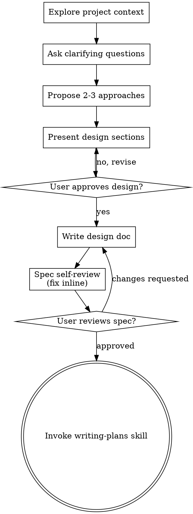

== SIDD ==
We're building Frontier. It is a static website that's a reference explorer and decision engine for frontier AI models, GPT-4 (Mar 2023) through Claude Fable 5 (Jun 2026), Muse Spark 1.1 (July 2026), GPT-5.6 (July 2026) and Grok 4.5 (July 2026). This spec is the base system only. A game extension we will add later so keep the data layer reusable but put nothing game-related in the spec.

Constraints: I dont wanna bear any cost for this system ever. GitHub Pages serving from docs/ on main (so all paths relative). No server, no accounts, no frameworks, no chart libraries. Vanilla JS, vitest for tests, npm test is "vitest run --passWithNoTests".

The pieces would include  a data pipeline merging a committed Epoch AI CSV snapshot (CC-BY, credit them) with a hand-curated JSON of pricing, context windows, GPQA and SWE-bench scores, and open/closed weights for ~40 models plus a hand-written events file for story moments like the Fable 5 export suspension. One merged models.json is the single source of truth, schema-validated, refreshed nightly by a GitHub Action that must never commit invalid output. A scenario engine of pure functions: given budget, task type, token volumes, and constraints, return qualifying models with computed costs, shown math, ranked by the task-relevant benchmark. An explorer UI: filterable sortable catalog, model cards with events, 2-3 way compare with simple bars, a horizontal timeline strip.

Look and feel: calm, premium, editorial, maybe see liquid glass thingie from Apple, one amber accent, strict type scale, nice spacing grid, mobile-first with one relevant breakpoint, no gradients or shadows, reduced-motion respected. Encode the design system as hard, checkable constraints in the spec, exact tokens n all; propose the token values and I'll approve them.

An autonomous agent loop builds from this spec slice by slice with a fresh context each iteration and a critic verifies the result against the spec by execution. So every acceptance criterion must be checkable by a command, a test, or an inspection an agent can perform. Nothing subjective pls. The spec is a contract a machine gets held to.

Ask me as many questions as you have, one batch at a time, until nothing material is open. Then write SPEC.md, under 500 lines, numbered criteria, exact model-record JSON schema (not included in lines limit), non-goals section, definition of done.

== CLAUDE ==
Using superpowers:brainstorming to work through the open questions before writing the spec.

== SIDD ==
Base directory for this skill: /Users/siddvoh/.claude/plugins/cache/claude-plugins-official/superpowers/6.1.1/skills/brainstorming

# Brainstorming Ideas Into Designs

Help turn ideas into fully formed designs and specs through natural collaborative dialogue.

Start by understanding the current project context, then ask questions one at a time to refine the idea. Once you understand what you're building, present the design and get user approval.

<HARD-GATE>
Do NOT invoke any implementation skill, write any code, scaffold any project, or take any implementation action until you have presented a design and the user has approved it. This applies to EVERY project regardless of perceived simplicity.
</HARD-GATE>

## Anti-Pattern: "This Is Too Simple To Need A Design"

Every project goes through this process. A todo list, a single-function utility, a config change — all of them. "Simple" projects are where unexamined assumptions cause the most wasted work. The design can be short (a few sentences for truly simple projects), but you MUST present it and get approval.

## Checklist

You MUST create a task for each of these items and complete them in order:

1. **Explore project context** — check files, docs, recent commits
2. **Offer the visual companion just-in-time** — NOT upfront. The first time a question would genuinely be clearer shown than described, offer it then (its own message); on approval its browser tab opens for you. If no visual question ever arises, never offer it. See the Visual Companion section below.
3. **Ask clarifying questions** — one at a time, understand purpose/constraints/success criteria
4. **Propose 2-3 approaches** — with trade-offs and your recommendation
5. **Present design** — in sections scaled to their complexity, get user approval after each section
6. **Write design doc** — save to `docs/superpowers/specs/YYYY-MM-DD-<topic>-design.md` and commit
7. **Spec self-review** — quick inline check for placeholders, contradictions, ambiguity, scope (see below)
8. **User reviews written spec** — ask user to review the spec file before proceeding
9. **Transition to implementation** — invoke writing-plans skill to create implementation plan

## Process Flow

**The terminal state is invoking writing-plans.** Do NOT invoke frontend-design, mcp-builder, or any other implementation skill. The ONLY skill you invoke after brainstorming is writing-plans.

## The Process

**Understanding the idea:**

- Check out the current project state first (files, docs, recent commits)
- Before asking detailed questions, assess scope: if the request describes multiple independent subsystems (e.g., "build a platform with chat, file storage, billing, and analytics"), flag this immediately. Don't spend questions refining details of a project that needs to be decomposed first.
- If the project is too large for a single spec, help the user decompose into sub-projects: what are the independent pieces, how do they relate, what order should they be built? Then brainstorm the first sub-project through the normal design flow. Each sub-project gets its own spec → plan → implementation cycle.
- For appropriately-scoped projects, ask questions one at a time to refine the idea
- Prefer multiple choice questions when possible, but open-ended is fine too
- Only one question per message - if a topic needs more exploration, break it into multiple questions
- Focus on understanding: purpose, constraints, success criteria

**Exploring approaches:**

- Propose 2-3 different approaches with trade-offs
- Present options conversationally with your recommendation and reasoning
- Lead with your recommended option and explain why

**Presenting the design:**

- Once you believe you understand what you're building, present the design
- Scale each section to its complexity: a few sentences if straightforward, up to 200-300 words if nuanced
- Ask after each section whether it looks right so far
- Cover: architecture, components, data flow, error handling, testing
- Be ready to go back and clarify if something doesn't make sense

**Design for isolation and clarity:**

- Break the system into smaller units that each have one clear purpose, communicate through well-defined interfaces, and can be understood and tested independently
- For each unit, you should be able to answer: what does it do, how do you use it, and what does it depend on?
- Can someone understand what a unit does without reading its internals? Can you change the internals without breaking consumers? If not, the boundaries need work.
- Smaller, well-bounded units are also easier for you to work with - you reason better about code you can hold in context at once, and your edits are more reliable when files are focused. When a file grows large, that's often a signal that it's doing too much.

**Working in existing codebases:**

- Explore the current structure before proposing changes. Follow existing patterns.
- Where existing code has problems that affect the work (e.g., a file that's grown too large, unclear boundaries, tangled responsibilities), include targeted improvements as part of the design - the way a good developer improves code they're working in.
- Don't propose unrelated refactoring. Stay focused on what serves the current goal.

## After the Design

**Documentation:**

- Write the validated design (spec) to `docs/superpowers/specs/YYYY-MM-DD-<topic>-design.md`
  - (User preferences for spec location override this default)
- Use elements-of-style:writing-clearly-and-concisely skill if available
- Commit the design document to git

**Spec Self-Review:**
After writing the spec document, look at it with fresh eyes:

1. **Placeholder scan:** Any "TBD", "TODO", incomplete sections, or vague requirements? Fix them.
2. **Internal consistency:** Do any sections contradict each other? Does the architecture match the feature descriptions?
3. **Scope check:** Is this focused enough for a single implementation plan, or does it need decomposition?
4. **Ambiguity check:** Could any requirement be interpreted two different ways? If so, pick one and make it explicit.

Fix any issues inline. No need to re-review — just fix and move on.

**User Review Gate:**
After the spec review loop passes, ask the user to review the written spec before proceeding:

> "Spec written and committed to `<path>`. Please review it and let me know if you want to make any changes before we start writing out the implementation plan."

Wait for the user's response. If they request changes, make them and re-run the spec review loop. Only proceed once the user approves.

**Implementation:**

- Invoke the writing-plans skill to create a detailed implementation plan
- Do NOT invoke any other skill. writing-plans is the next step.

## Key Principles

- **One question at a time** - Don't overwhelm with multiple questions
- **Multiple choice preferred** - Easier to answer than open-ended when possible
- **YAGNI ruthlessly** - Remove unnecessary features from all designs
- **Explore alternatives** - Always propose 2-3 approaches before settling
- **Incremental validation** - Present design, get approval before moving on
- **Be flexible** - Go back and clarify when something doesn't make sense

## Visual Companion

A browser-based companion for showing mockups, diagrams, and visual options during brainstorming. Available as a tool — not a mode. Accepting the companion means it's available for questions that benefit from visual treatment; it does NOT mean every question goes through the browser.

**Offering the companion (just-in-time):** Do NOT offer it upfront. Wait until a question would genuinely be clearer shown than told — a real mockup / layout / diagram question, not merely a UI *topic*. The first time that happens, offer it then, as its own message:
> "This next part might be easier if I show you — I can put together mockups, diagrams, and comparisons in a browser tab as we go. It's still new and can be token-intensive. Want me to? I'll open it for you."

**This offer MUST be its own message.** Only the offer — no clarifying question, summary, or other content. Wait for the user's response. If they accept, start the server with `--open` so their browser opens to the first screen automatically. If they decline, continue text-only and don't offer again unless they raise it.

**Per-question decision:** Even after the user accepts, decide FOR EACH QUESTION whether to use the browser or the terminal. The test: **would the user understand this better by seeing it than reading it?**

- **Use the browser** for content that IS visual — mockups, wireframes, layout comparisons, architecture diagrams, side-by-side visual designs
- **Use the terminal** for content that is text — requirements questions, conceptual choices, tradeoff lists, A/B/C/D text options, scope decisions

A question about a UI topic is not automatically a visual question. "What does personality mean in this context?" is a conceptual question — use the terminal. "Which wizard layout works better?" is a visual question — use the browser.

If they agree to the companion, read the detailed guide before proceeding:
`skills/brainstorming/visual-companion.md`

ARGUMENTS: Spec for Frontier: static GitHub Pages reference explorer + decision engine for frontier AI models, vanilla JS, data pipeline, scenario engine, explorer UI, machine-checkable acceptance criteria

== CLAUDE ==

== CLAUDE ==

== SIDD ==

== CLAUDE ==

== SIDD ==

== CLAUDE ==

== CLAUDE ==

== SIDD ==

== SIDD ==

== CLAUDE ==

== CLAUDE ==

== CLAUDE ==

== SIDD ==

== CLAUDE ==

== CLAUDE ==

== CLAUDE ==

== SIDD ==

== CLAUDE ==

== CLAUDE ==

== CLAUDE ==

== SIDD ==

== CLAUDE ==

== CLAUDE ==

== CLAUDE ==

== SIDD ==

== CLAUDE ==

== CLAUDE ==
Nothing material is left open. Here's the design for approval, tokens first since you wanted to sign off on exact values.

## Design tokens (proposal)

All values live in `docs/css/tokens.css` as CSS custom properties; both themes auto-switch via `prefers-color-scheme`. Hard rules the critic can grep: raw hex/rgb values may appear only in tokens.css, `gradient(` and `box-shadow` appear nowhere, every other stylesheet uses `var()` only.

**Color, light:** background `#FAF9F7` (warm paper), glass surface `rgba(255 255 255 / 0.62)`, ink `#1A1815`, muted text `#6B675F`, hairline border `#E5E2DC`, accent amber `#B45309` (4.9:1 on the background).

**Color, dark:** background `#141310`, glass surface `rgba(32 30 26 / 0.62)`, ink `#ECEAE4`, muted `#98948A`, hairline `#2E2B26`, accent amber `#E8A33D`.

**Type:** display stack `Charter, Georgia, serif` for headings (editorial feel, zero webfont requests), text stack `-apple-system, BlinkMacSystemFont, "Segoe UI", sans-serif`. Strict 1.25 modular scale, six steps only: 13 / 16 / 20 / 25 / 31 / 39 px. Line heights 1.5 body, 1.2 headings. Any `font-size` outside these six tokens is a spec violation.

**Spacing:** 4px grid, eight tokens only: 4, 8, 12, 16, 24, 32, 48, 64.

**Other:** radii 6px and 12px; glass blur `backdrop-filter: blur(12px)` allowed only on header and floating panels; motion one duration token 150ms ease-out, and a `prefers-reduced-motion` block sets all durations to 0. One breakpoint at 720px, mobile-first (base styles are mobile).

## Architecture

**Repo layout:** `data/` holds the three inputs (committed Epoch CSV snapshot, your hand-written `curated.json` and `events.json`), `scripts/` holds the Node pipeline (fetch-epoch, merge, validate), `docs/` is the site (index.html, css, js, and the generated `docs/data/models.json`). The pipeline emits one artifact, `docs/data/models.json`, containing models, events, generation timestamp, and the Epoch CC-BY attribution string: the single source of truth the site fetches once.

**Merge:** curated.json is master; exact-match join on each record's `epochName` to enrich with release date, parameters, training compute, organization. Per-field `sources` tags. Nulls pass through untouched; a criterion bans any code path that generates, estimates, imputes, or defaults a stat value, and tests assert null-in, null-out.

**Engine:** pure functions in `docs/js/engine.js` (cost formula, qualify, rank with the tie-break chain you specified, per-task ranking fields). Imported directly by vitest, no DOM.

**UI:** single page, hash routing (`#/catalog`, `#/model/:id`, `#/compare`, `#/scenario`, timeline strip on catalog). Views are pure render functions tested with jsdom. Missing values render as an em dash and never enter computations.

**CI:** `npm test` is the only gate (vitest: pipeline, schema, engine, render tests). Nightly Action refetches Epoch, rebuilds, validates, runs tests, commits only if green and changed; any failure means no commit and a red run.

**Non-goals in spec:** game features, accounts, server code, analytics, chart libraries, frameworks, invented data, any paid service.

If the tokens and this shape look right, say go and I'll write SPEC.md (under 500 lines, numbered criteria, exact model-record JSON schema excluded from the count, non-goals, definition of done).

== SIDD ==
ok go ahead but few changes are needed. the glass thing, I actually do want the liquid glass look, so keep it. but only on 3 places: sticky header, the floating panels (compare tray + scenario results), and the model card overlay. nowhere else. make that a greppable rule.also glass needs a fallback. backdrop-filter stuff goes inside @supports, and outside it use a solid near-opaque version of the surface token. text on glass should still hit 4.5:1 against the solid fallback since thats the worst case. you banned box-shadow completely but floating glass panels NEED some seperation from the content behind. so one shadow token in tokens.css, subtle, only allowed on those same 3 glass components. everywhere else still banned. add a test that every color token exists in both light and dark blocks so we dont ship one theme with a missing var. ALSO V IMP add a scripts/screenshot.js using playwright as a devDependency. npm run shots, NOT part of npm test, the loop never touches it. it serves docs/, screenshots each route (#/catalog, #/model/:id with a seeded model, #/compare, #/scenario) at 375x812 and 1440x900, both themes, dumps pngs into shots/ (gitignored). no pixel assertions no diffing, its just for me to eyeball. acceptance criteria is only that it runs and produces the 16 pngs. everything else approved as you proposed. write SPEC.md now.

== CLAUDE ==

== CLAUDE ==
All decisions are in. Writing SPEC.md now with the glass scoping, fallback and shadow rules, the theme-parity test, and the screenshot harness encoded as hard criteria.

== CLAUDE ==

== SIDD ==

== CLAUDE ==

== CLAUDE ==

== CLAUDE ==

== SIDD ==

== CLAUDE ==

== SIDD ==

== CLAUDE ==

== SIDD ==

== CLAUDE ==

== CLAUDE ==
SPEC.md is written at [SPEC.md](SPEC.md): 487 lines total, 380 excluding the schema section, so comfortably under the 500-line limit. The only em dash in the file is the mandated `MISSING = "—"` UI literal.

What it contains:

- **54 numbered criteria (C1-C54)**, each ending with a `Check:` line naming the grep, test, or execution that verifies it, grouped into repo/toolchain, data inputs, pipeline, missing-data rules, engine, UI, design system, testing, CI, and the screenshot harness.
- **No-invention rule** as hard criteria (C19-C21): null-in/null-out property tests, greppable bans on `?? 0`, `|| 0`, and `Math.random`, human-only authorship of curated.json and events.json (C10-C11), and exclusion-not-substitution for every computation.
- **Your glass changes encoded**: `.glass` restricted to exactly the four selectors covering the three components (header, compare tray + scenario results, model overlay) with a jsdom test plus grep (C43); solid `--surface-solid` fallback outside a single `@supports` block (C44); one `--shadow-glass` token whose `box-shadow` usage is grep-counted to exactly three occurrences repo-wide (C45); 4.5:1 contrast verified computationally against the solid worst case in both themes (C39); theme-parity test on the eight-token theme set (C38).
- **Screenshot harness** (C53-C54): `npm run shots`, playwright as devDependency, 4 routes x 2 viewports x 2 color schemes = 16 PNGs into gitignored `shots/`, acceptance is only exit 0 plus the file count, and grep-verified absence from `npm test` and both workflows.
- **Non-goals** (game, server, frameworks, paid services, invented data, visual diffing) and a **definition of done** with seven executable conditions.

One thing to flag: C9 pins the Epoch fetch URL as `https://epoch.ai/data/notable_ai_models.csv`, and `data/epoch-columns.json` (C12) keeps the CSV header names out of code so you can correct either without a spec change if Epoch's actual URL or headers differ.

Please review the spec, especially the token values in C37/C40/C41 now frozen as contract values, and the two seed files it expects from you before the loop runs (curated.json, events.json). Once you're happy, commit it and `./sidd.sh plan` takes over from there.

== SIDD ==
add to C51 that the workflow declares permissions contents: write otherwise the push step will fail on default token perms.

== CLAUDE ==

== SIDD ==

== CLAUDE ==
Done. C51 now requires the refresh workflow to declare `permissions: contents: write`, with the rationale noted, and it remains covered by C51's existing inspection check. The file is at 489 lines, still under the limit.